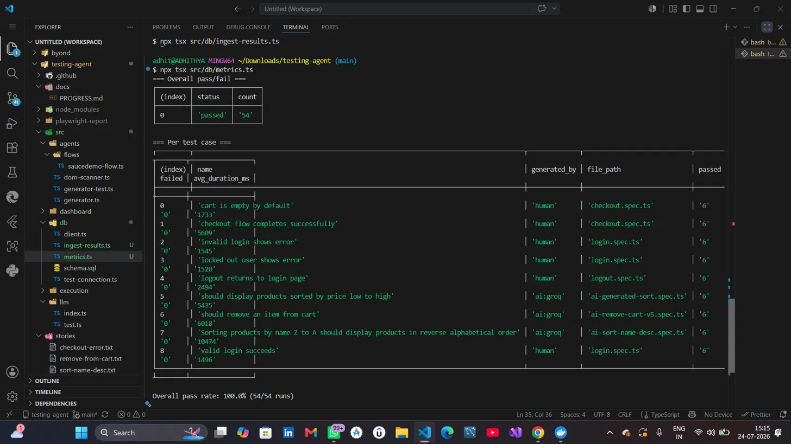

# Testing Agent — Progress Log

## Baseline (Sprint 1) — 22 July 2026
- Hand-coded test suite: 6 test cases (login x3, checkout x2, logout x1)
- Cross-browser: chromium, firefox, webkit (18 total test runs per suite execution)
- Flake check: 10/10 consecutive runs, 18/18 passed every run, 0% flake rate
- Target app: saucedemo.com (practice/demo target — client app pending)
- CI: not yet wired [update once GitHub Actions confirmed]

## Baseline (Sprint 1) — 22 July 2026
- Hand-coded test suite: 6 test cases (login x3, checkout x2, logout x1)
- Cross-browser: chromium, firefox, webkit (18 total test runs per suite execution)
- Flake check: 10/10 consecutive runs, 18/18 passed every run, 0% flake rate
- CI: GitHub Actions confirmed green — https://github.com/adhithyakumaran/testing-agent/actions/runs/29897607262 (2m 37s)
- Target app: saucedemo.com (practice/demo target — client app pending)

## Sprint 2 — AI Test Generation (first attempt) — 22 July 2026
- Provider: Groq (llama-3.3-70b-versatile) — dev only, will switch to Anthropic for client delivery
- Test 1: "sort products by price low-to-high" — generated correctly on first attempt, 0 manual corrections needed
- Assertion quality: used dynamic sort-comparison instead of hardcoded values (robust pattern)
- Flake check: 5/5 runs, 3/3 passed every run, 0% flake rate
- Correction rate so far: 0/1 tests needed fixes (1 data point — too early to draw conclusions)

## Sprint 2 — Generation precision, round 2 — 22 July 2026
- Test 3 (sort Z-A, detailed story): correct on first attempt, matched known selectors
- Test 1 (checkout error, missing login step in story): FAILED — skipped login, hallucinated selector "add-to-cart"
- Test 2 (remove from cart, deliberately vague story): FAILED — hallucinated 2 selectors, wrong assertion logic
- Finding: generator is reliable (3/3 so far) when given exact selectors + full flow context;
  unreliable (0/2) when story omits selectors or steps — model fabricates plausible-looking
  but incorrect details rather than flagging missing information
- Precision so far: 2/4 tests correct on first attempt (50%) across all stories tested
- Implication: the coverage-planning agent (later sprint) or your own review process needs to
  enforce that generated tests always come with real selectors, not vague descriptions

  --screent shot of the progress

  ## Sprint 3 (start) — Metrics infrastructure — 24 July 2026
- Postgres-backed test run history live: 9 test cases, 54 total runs tracked
- Overall pass rate: 100% (54/54)
- Mix: 5 human-written baseline tests, 3 AI-generated (Groq) — all passing equally
- Per-test duration tracking now available for trend analysis over time