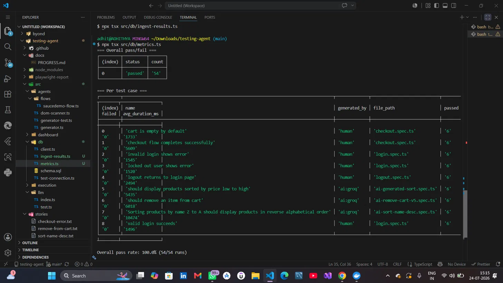

# Testing Agent — Progress Log

## Baseline (Sprint 1) — 22 July 2026
- Hand-coded test suite: 6 test cases (login x3, checkout x2, logout x1)
- Cross-browser: chromium, firefox, webkit (18 total test runs per suite execution)
- Flake check: 10/10 consecutive runs, 18/18 passed every run, 0% flake rate
- Target app: saucedemo.com (practice/demo target — client app pending)
- CI: not yet wired [update once GitHub Actions confirmed]

## Baseline (Sprint 1) — 22 July 2026
- Hand-coded test suite: 6 test cases (login x3, checkout x2, logout x1)
- Cross-browser: chromium, firefox, webkit (18 total test runs per suite execution)
- Flake check: 10/10 consecutive runs, 18/18 passed every run, 0% flake rate
- CI: GitHub Actions confirmed green — https://github.com/adhithyakumaran/testing-agent/actions/runs/29897607262 (2m 37s)
- Target app: saucedemo.com (practice/demo target — client app pending)

## Sprint 2 — AI Test Generation (first attempt) — 22 July 2026
- Provider: Groq (llama-3.3-70b-versatile) — dev only, will switch to Anthropic for client delivery
- Test 1: "sort products by price low-to-high" — generated correctly on first attempt, 0 manual corrections needed
- Assertion quality: used dynamic sort-comparison instead of hardcoded values (robust pattern)
- Flake check: 5/5 runs, 3/3 passed every run, 0% flake rate
- Correction rate so far: 0/1 tests needed fixes (1 data point — too early to draw conclusions)

## Sprint 2 — Generation precision, round 2 — 22 July 2026
- Test 3 (sort Z-A, detailed story): correct on first attempt, matched known selectors
- Test 1 (checkout error, missing login step in story): FAILED — skipped login, hallucinated selector "add-to-cart"
- Test 2 (remove from cart, deliberately vague story): FAILED — hallucinated 2 selectors, wrong assertion logic
- Finding: generator is reliable (3/3 so far) when given exact selectors + full flow context;
  unreliable (0/2) when story omits selectors or steps — model fabricates plausible-looking
  but incorrect details rather than flagging missing information
- Precision so far: 2/4 tests correct on first attempt (50%) across all stories tested
- Implication: the coverage-planning agent (later sprint) or your own review process needs to
  enforce that generated tests always come with real selectors, not vague descriptions

  --screent shot of the progress

  ## Sprint 3 (start) — Metrics infrastructure — 24 July 2026
- Postgres-backed test run history live: 9 test cases, 54 total runs tracked
- Overall pass rate: 100% (54/54)
- Mix: 5 human-written baseline tests, 3 AI-generated (Groq) — all passing equally
- Per-test duration tracking now available for trend analysis over time

## Sprint 4: Failure Triage — [DATE]

**Goal:** distinguish real selector drift (fixable by the healer) from other
failure types (assertion mismatches, unclear timeouts) that the healer should
never attempt to "fix."

### What was built
- `classifyFailure()` — pattern-matches Playwright error text first (free,
  instant, deterministic); falls back to an LLM classification call only when
  the error shape is genuinely ambiguous.
- Four categories: `selector_not_found`, `assertion_mismatch`,
  `timeout_unclear`, `other`.
- `heal-failures.ts` now classifies every failure BEFORE deciding whether to
  run the (expensive) DOM scan + healer step — only `selector_not_found`
  triggers healing. Other categories are logged directly for human review,
  with their category and reasoning attached, no wasted scan/LLM calls.
- `healing_events` schema extended with `failure_category` and
  `classification_reasoning` columns; `old_selector`/`new_selector` made
  nullable to support non-selector entries.

### Bugs found and fixed during this work (documented honestly, not hidden)
1. **Healer's scan blind spot:** the healer only ever scanned the login page,
   so any selector belonging to a later page (e.g. `checkout`, only present on
   the cart page) always came back "NO MATCH" — not because it was genuinely
   unfixable, but because it was never shown the right page. Fixed by scanning
   the FULL flow (`scanFlowSelectors`) instead of a single static page.
2. **Classifier false positive:** the first version of `classifyFailure` used
   the literal phrase "waiting for locator" as a signal that an element was
   never found. That phrase is actually Playwright's standard retry-log
   header and appears in EVERY assertion call, whether the element was found
   or not. This caused a genuine content-mismatch failure (right element,
   wrong expected text) to be misclassified as `selector_not_found`, and the
   healer then "fixed" a selector that was never broken. Corrected by using
   the presence of "locator resolved to..." (proof the element WAS found) as
   the real signal, instead of the generic retry-log phrase.

### Verified end-to-end (real test runs, not simulated)
- Real selector rename (`checkout` → `checkout-x`) → correctly classified
  `selector_not_found`, healer correctly proposed `button[data-test="checkout"]`
  at high confidence.
- Real content mismatch (correct selector, wrong expected text) → correctly
  classified `assertion_mismatch`, healer was NOT invoked, logged for human
  review instead.

### Known limitations, not yet addressed
- The healer's flow scan is hardcoded to a single client app (`saucedemo`).
  Once a second client app is onboarded, `heal-failures.ts` needs a way to
  know which app a given failing test belongs to (e.g. store the app name on
  `test_cases` at generation time).
- Triage only distinguishes selector vs. non-selector failures. It does not
  yet detect flakiness (i.e. re-running a failed test to see if it passes on
  retry before assuming it's a real, persistent failure).